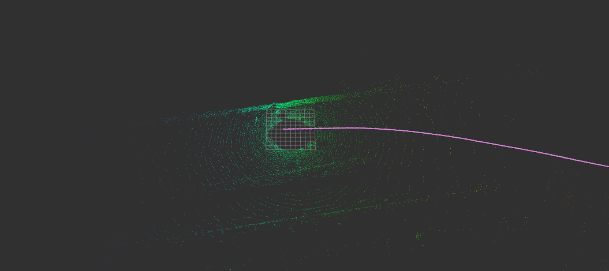

# LiDAR_SLAM

A simple ROS2 LiDAR odometry demo using Open3D point-to-plane ICP, to showcase some knowledge in the field. A Python node (`simple_lidar_icp_odometry.py`) subscribes to a KITTI-style `sensor_msgs/PointCloud2` on `/kitti/point_cloud`, downsamples, estimates normals, runs incremental ICP, integrates the transform, and publishes `nav_msgs/Odometry` on `pointcloud/odom`. A lightweight loop "detection" heuristic (timestamp jump) resets the internal state.

## Visualization
Image snapshot:

Video (inline if supported):

<video src="readme_files/vid.mp4" controls loop muted playsinline width="640"></video>

[View Video](../readme_files/vid.mp4)