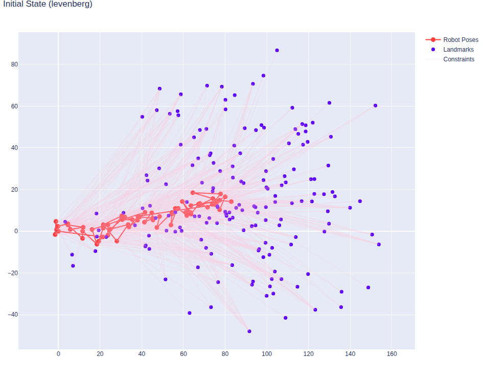
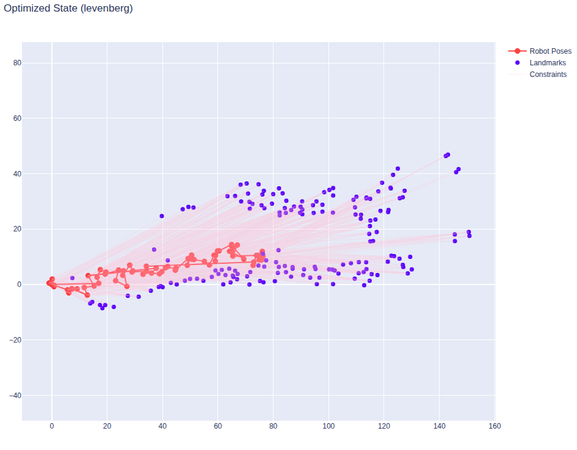
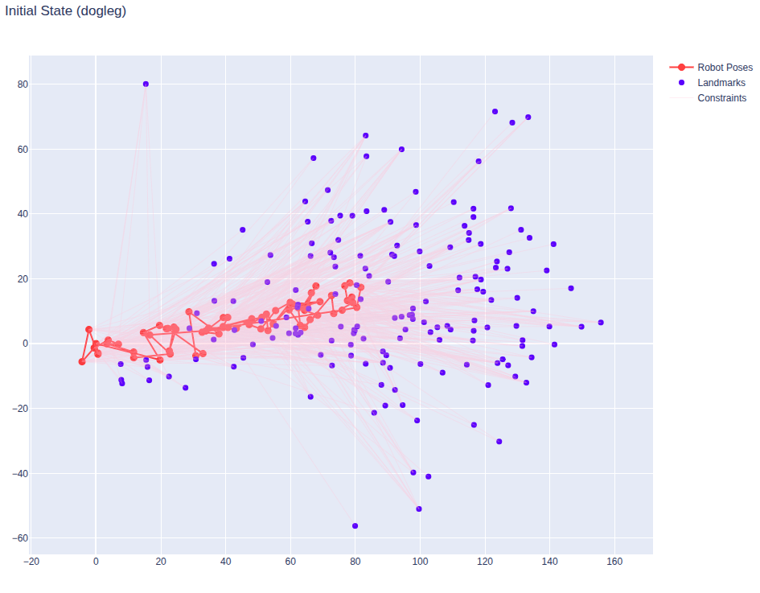
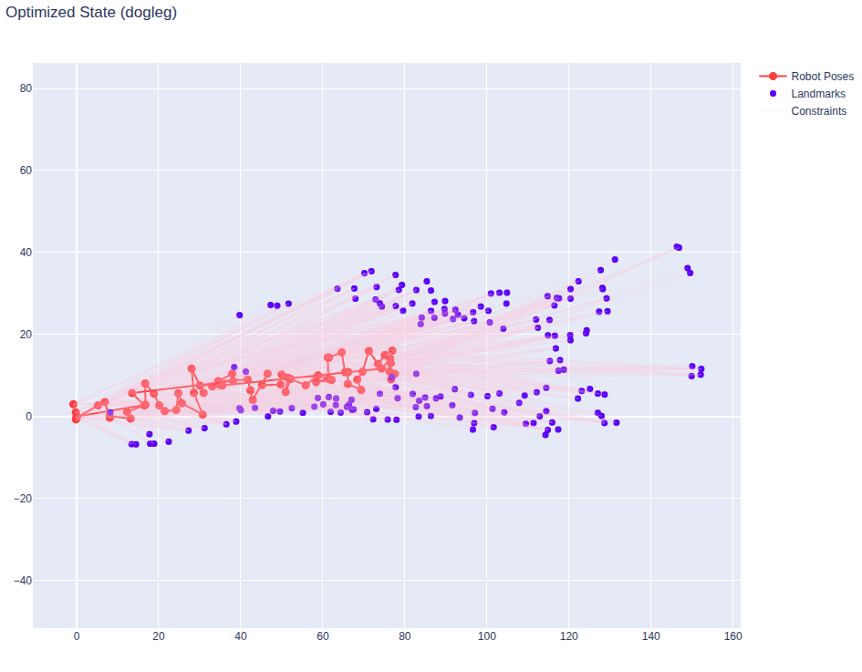
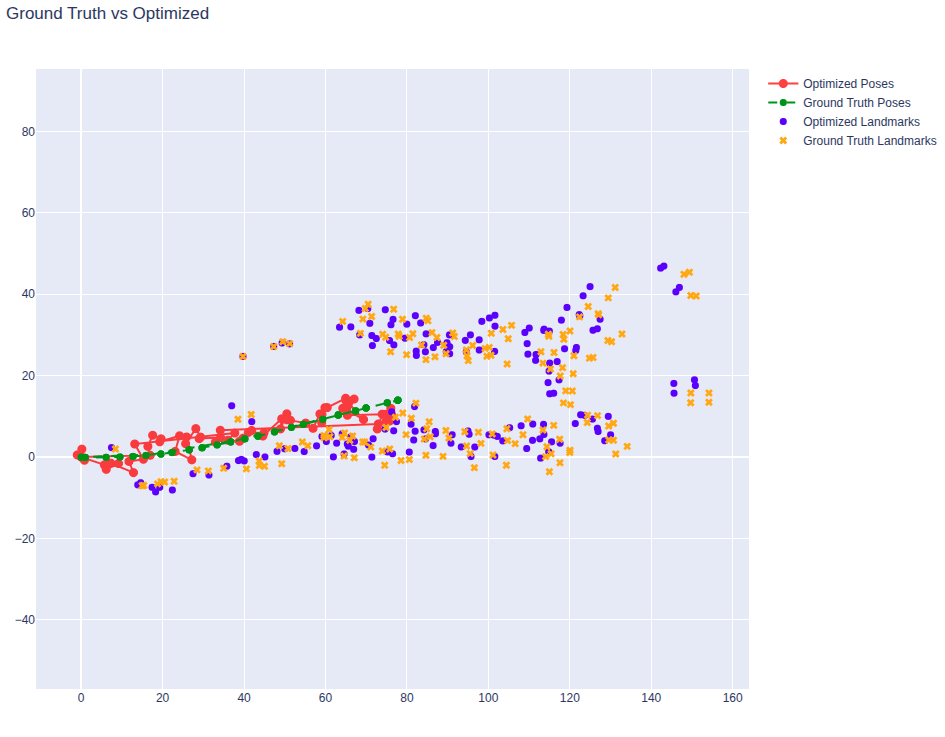
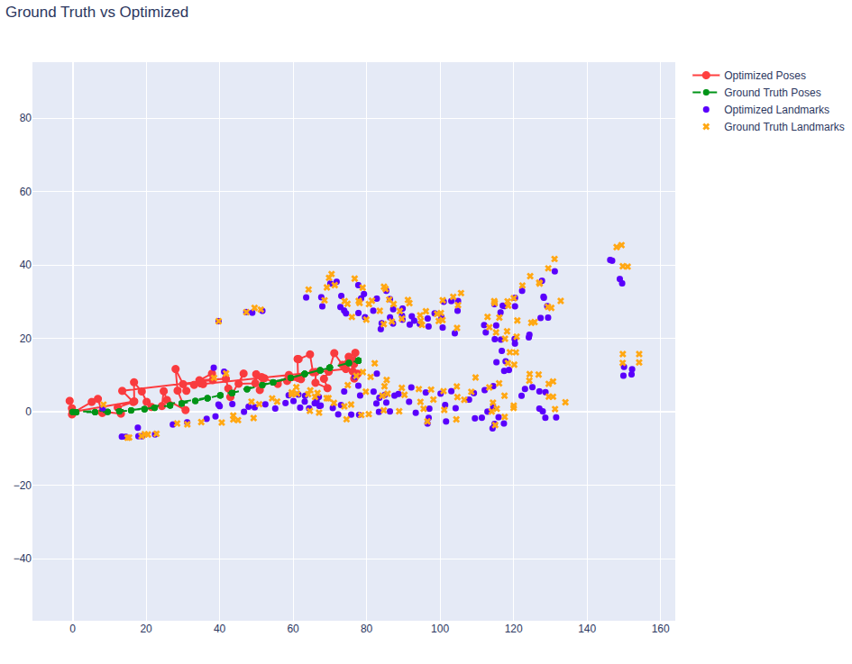

# Mapping & Loop Closure (Visual + LiDAR Feature Hash Map)

Lightweight 2D mapping and loop-closure layer built on top of LiDAR odometry.  
Fuses camera ORB features with LiDAR scan ranges to create persistent landmarks, manages them in a spatial hash map, and performs simple loop closure via landmark reuse + graph optimization.

## Overview
- Extract ORB keypoints, cluster with DBSCAN (reduce redundancy).
- Project clustered keypoints to angles (camera -> bearing).
- Associate with LaserScan beams (angle & range gating).
- Convert to robot-local (x,y), then to global frame (odometry).
- Insert / match in VisualHashMap (spatial + descriptor gating).
- Build pose-landmark constraints; detect revisits when old landmark IDs reappear.
- Optimize (g2o-style) pose graph for drift reduction.

## Key Components
- visual_hashmap.py: Landmark clustering & descriptor-based update.
- features_utils.py: ORB + DBSCAN + projection + scan association helpers.
- graph_slam_data.py: Stores nodes, edges.
- graph_slam_g2o.py: Simple optimizer/export.
- vis_mapping_closure.py / visualizer.py: Live visualization & debug.

## Landmark Handling
Two-tier clustering:
1. Image-space DBSCAN → representative feature per blob.
2. Map-space Feature clusters (hash grid) → temporal fusion (avg position + descriptor history).

Matching gates:
- Sector (overlapping FoV) + max range
- Euclidean proximity
- ORB descriptor (BFMatcher Hamming distance)

## Visualization
Embedded (local GIF):


If the GIF does not render in some viewers, open the file directly under `readme_files/`.

## Running (example)
```bash
# Ensure dependencies
pip install numpy opencv-python scikit-learn

# Run mapping / loop-closure visualization node (adjust to your launch pattern)
ros2 run your_pkg vis_mapping_closure
```

Inputs expected:
- /scan (sensor_msgs/LaserScan)
- /image (sensor_msgs/Image)
- Odometry (topic you adapt inside code)

## Important Parameters (tune in code)
- DBSCAN: eps, min_samples
- VisualHashMap: cell_size, descriptor_distance_threshold, cluster_proximity_threshold
- Association: max_lidar_range, max_angular_difference, overlapping_sector

## Loop Closure Trigger
Re-observation of existing landmark IDs across spatial separation → added constraints → optimize graph.

## Notes
- No outlier rejection beyond simple thresholds.
- Descriptor & coordinate histories unbounded (add pruning if needed).
- Works best with moderately structured scenes (distinctive features).

## Future Improvements
- Adaptive cell size
- Descriptor pruning / aging
- Robust backend (switch to Ceres / g2o bindings)
-

## Optimization Stage (Pose & Landmark Refinement)
After data collection and landmark association, a pose-graph + landmark graph is optimized:
- Vertices: robot poses (SE2) + landmark points (PointXY).
- Edges: relative odometry constraints + landmark observation (range/bearing converted to local Cartesian) constraints.
- Artificial Gaussian noise is injected into initial pose and landmark estimates so the solver has a non-trivial problem (initial chi2 > 0).
- Supported solvers (g2o): Gauss-Newton (default), Levenberg-Marquardt, Dogleg. Select via `method` parameter when constructing `GraphSLAM`.
- Objective: minimize sum of squared residuals (odometry + landmark reprojection) jointly updating all poses and landmark positions.

### Solver Comparison Snapshots
Small thumbnails (initial vs optimized) for different solvers:

| Levenberg Init | Levenberg Opt | Dogleg Init | Dogleg Opt |
| -------------- | ------------- | ----------- | ---------- |
|  |  |  |  |

### Final Solver Outputs

**Levenberg-Marquardt**



**Dogleg**



Interpretation:
- Initial graphs show dispersed (noisy) pose chain and landmarks.
- Optimized results contract drift, align loop overlaps, and cluster landmark estimates more tightly.
- Differences between solvers are subtle on small problems; Dogleg may converge faster, Levenberg can be steadier with higher initial error.

Tuning hints:
- Reduce `pose_std_dev` / `landmark_std_dev` to trust priors less (larger residuals → more adjustment).
- Increase injected noise (in `add_odometry` / `add_landmark`) to stress-test convergence.
- Swap solver by passing `method="levenberg"` or `method="dogleg"` to `GraphSLAM`.
