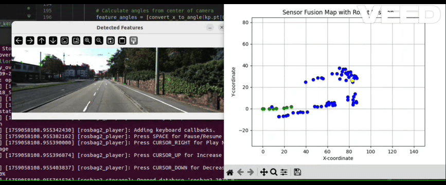

# Mapping & Loop Closure (Visual + LiDAR Feature Hash Map)

Lightweight 2D mapping and loop-closure layer built on top of LiDAR odometry.  
Fuses camera ORB features with LiDAR scan ranges to create persistent landmarks, manages them in a spatial hash map, and performs simple loop closure via landmark reuse + graph optimization.

## Overview
- Extract ORB keypoints, cluster with DBSCAN (reduce redundancy).
- Project clustered keypoints to angles (camera -> bearing).
- Associate with LaserScan beams (angle & range gating).
- Convert to robot-local (x,y), then to global frame (odometry).
- Insert / match in VisualHashMap (spatial + descriptor gating).
- Build pose-landmark constraints; detect revisits when old landmark IDs reappear.
- Optimize (g2o-style) pose graph for drift reduction.

## Landmark Handling
Two-tier clustering:
1. Image-space DBSCAN → representative feature per blob.
2. Map-space Feature clusters (hash grid) → temporal fusion (avg position + descriptor history).

Matching gates:
- Sector (overlapping FoV) + max range
- Euclidean proximity
- ORB descriptor (BFMatcher Hamming distance)

## Visualization
Embedded (local GIF):



If the GIF does not render in some viewers, open the file directly under `readme_files/`.

## Running (example)
```bash
# Ensure dependencies
pip install numpy opencv-python scikit-learn

# Run mapping / loop-closure visualization node (adjust to your launch pattern)
ros2 run your_pkg vis_mapping_closure
```

Inputs expected:
- /scan (sensor_msgs/LaserScan)
- /image (sensor_msgs/Image)
- Odometry (topic you adapt inside code)

## Important Parameters (tune in code)
- DBSCAN: eps, min_samples
- VisualHashMap: cell_size, descriptor_distance_threshold, cluster_proximity_threshold
- Association: max_lidar_range, max_angular_difference, overlapping_sector

## Loop Closure Trigger
Re-observation of existing landmark IDs across spatial separation → added constraints → optimize graph.

## Notes
- No outlier rejection beyond simple thresholds.
- Descriptor & coordinate histories unbounded (add pruning if needed).
- Works best with moderately structured scenes (distinctive features).

## Future Improvements
- Adaptive cell size
- Descriptor pruning / aging
- Robust backend (switch to Ceres / g2o bindings)
-
